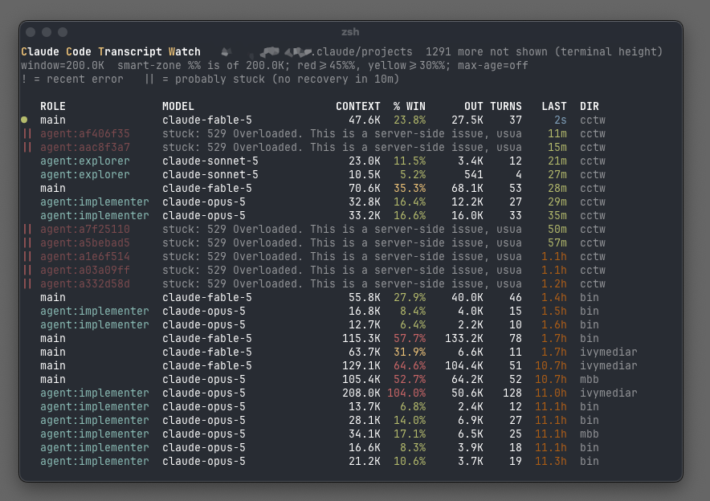

# cctw — Claude Code Transcript Watch

A small terminal dashboard that live-tails the JSONL transcript files Claude
Code writes under `~/.claude/projects/`. For every active session — main
threads and subagent sidechains alike — it shows the model, current context
size (absolute and as a % of the context window, color-coded), cumulative
output tokens, turn count, time since last activity, and the working
directory. Handy for keeping an eye on context usage and subagent activity
across several concurrent Claude Code sessions.



## Requirements

Python 3.10+, standard library only. No install: it's one file.

## Usage

```
python3 cctw.py                  # watch all projects under ~/.claude/projects
python3 cctw.py PATH             # watch one project dir, working dir, or .jsonl file
python3 cctw.py --window 200000  # context window size for the % column
python3 cctw.py --max-age 4      # hide sessions idle longer than 4 hours
python3 cctw.py --log            # one event line per assistant turn, no dashboard
python3 cctw.py --inspect        # dump one parsed transcript entry and exit
python3 cctw.py --dumphistory    # write all sessions to cctw.dump.YYMMDD.HOSTNAME.txt and exit
```

Note: the transcript format is internal to Claude Code and changes between
releases. The script parses defensively (unknown fields ignored, bad lines
skipped), and `--inspect` shows you what your version actually writes.

## Status

Published as-is, for inspiration. Not maintained; pull requests and issues
won't be looked at. If it's useful to you, fork it and make it your own.

## Credits

Written by Claude (Anthropic's Claude Code), directed by anwac.
MIT licensed — see [LICENSE](LICENSE).
